# 🚦 Distributed Big Data Pipeline for Urban Mobility Analytics (Hive + HDFS + YARN)

## 📌 Project Overview

This project implements an **end-to-end distributed Big Data pipeline** to analyze urban mobility patterns using multiple datasets:

* Vehicle mobility data
* Traffic sensor data
* Public transport data

The system leverages **HDFS for distributed storage**, **Hive for SQL-based data processing**, and **YARN for resource management**, with results visualized through **Power BI dashboards**.

The project simulates a **real-world data engineering workflow**, including data ingestion, distributed storage, processing, and analytical querying.

The objective is to identify congestion patterns, traffic intensity, and public transport demand to support **data-driven urban planning decisions**.

---

## 🚀 Project Highlights

* End-to-end Big Data pipeline using Hive and HDFS
* Multi-source data integration (mobility, sensors, transport)
* Distributed processing with YARN
* Business-focused analytics for urban mobility optimization

---

## ⚙️ Architecture

```
Data Sources → HDFS → Hive (SQL Processing) → YARN → Power BI
```

📸 Architecture Diagram:
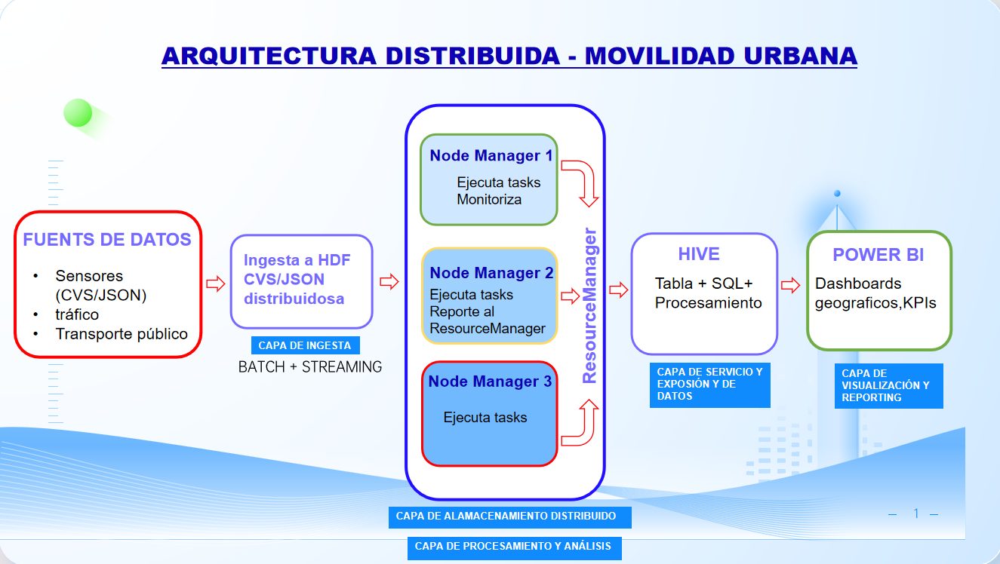

---

## 🛠️ Tech Stack

* Python
* Apache Hive
* HDFS
* YARN
* Power BI

---

## 🔄 Data Pipeline

1. Data ingestion from multiple sources (CSV / JSON)
2. Storage in HDFS (distributed system)
3. Data processing using Hive (SQL queries)
4. Query execution managed by YARN
5. Visualization using Power BI dashboards

---

## 📊 Key Analyses & Queries

### 🚦 1. Congestion by Zone

```sql
SELECT zona, congestion_level, COUNT(*) 
FROM movilidad
GROUP BY zona, congestion_level;
```

📸 Result:
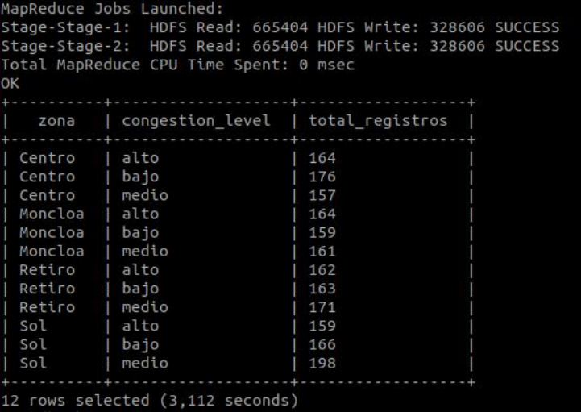

💡 Insight:
High congestion levels are concentrated in central urban zones, indicating traffic bottlenecks and potential need for infrastructure optimization.

---

### 🚗 2. Average Speed by Vehicle Type

```sql
SELECT vehicle_type, AVG(velocidad_kmh) 
FROM movilidad
GROUP BY vehicle_type;
```

📸 Result:
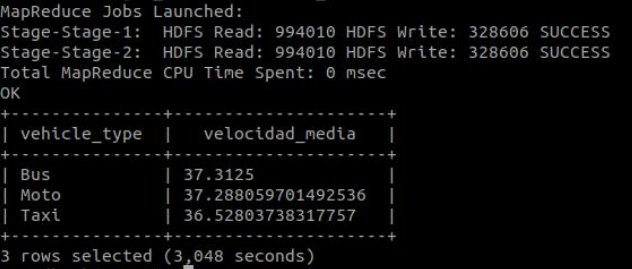

💡 Insight:
Differences in average speeds across vehicle types highlight how congestion impacts mobility efficiency.

---

### ⏰ 3. Peak Hours Analysis

```sql
SELECT SUBSTR(ts,12,2) AS hora, COUNT(*) 
FROM movilidad
GROUP BY SUBSTR(ts,12,2);
```

📸 Result:
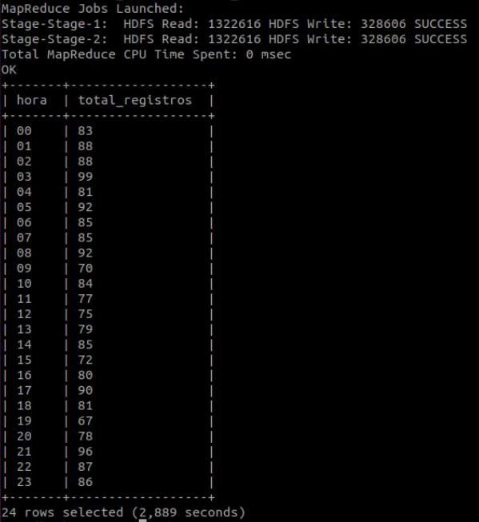

💡 Insight:
Traffic peaks occur during typical commuting hours, confirming expected urban mobility patterns.

---

### 📡 4. Vehicles Detected by Zone (Sensors)

```sql
SELECT zona, SUM(vehiculos_detectados)
FROM sensores_trafico
GROUP BY zona;
```

📸 Result:
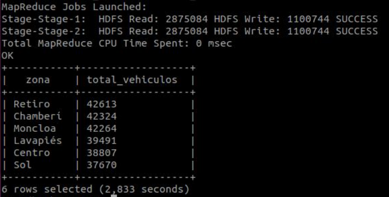

💡 Insight:
Certain zones consistently show higher traffic density, validating congestion patterns observed in mobility data.

---

### ⚙️ 5. Sensor Status Monitoring

```sql
SELECT estado_sensor, COUNT(*) 
FROM sensores_trafico
GROUP BY estado_sensor;
```

📸 Result:
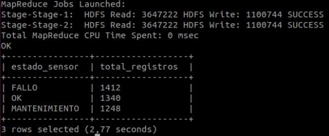

💡 Insight:
Monitoring sensor status ensures data reliability and helps detect faulty or inactive sensors.

---

### 🚌 6. Passengers per Line

```sql
SELECT linea, SUM(pasajeros)
FROM transporte_publico
GROUP BY linea;
```

📸 Result:
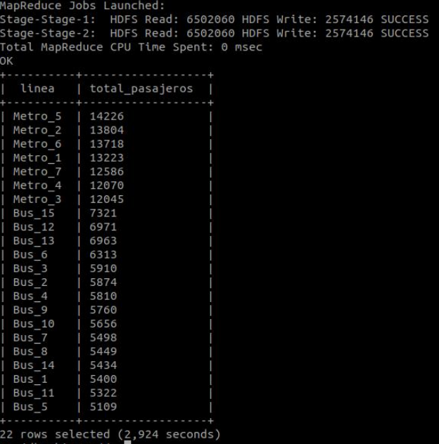

💡 Insight:
Certain transport lines carry significantly more passengers, identifying key routes in the urban mobility network.

---

### 🔥 7. Cross Analysis: Congestion + Public Transport

```sql
SELECT m.zona, COUNT(*) AS congestion, SUM(t.pasajeros)
FROM movilidad m
JOIN transporte_publico t
ON m.zona = t.zona
WHERE m.congestion_level = 'alto'
GROUP BY m.zona;
```

📸 Result:
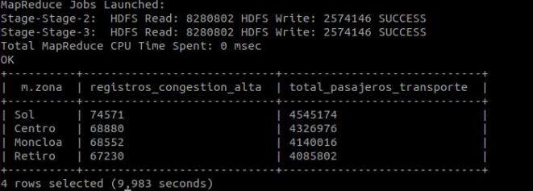

💡 Insight:
Zones with both high congestion and high public transport demand indicate areas under significant infrastructure pressure and strong candidates for optimization.

---

## 📊 Dashboards (Power BI)

### 🌍 Overview Dashboard

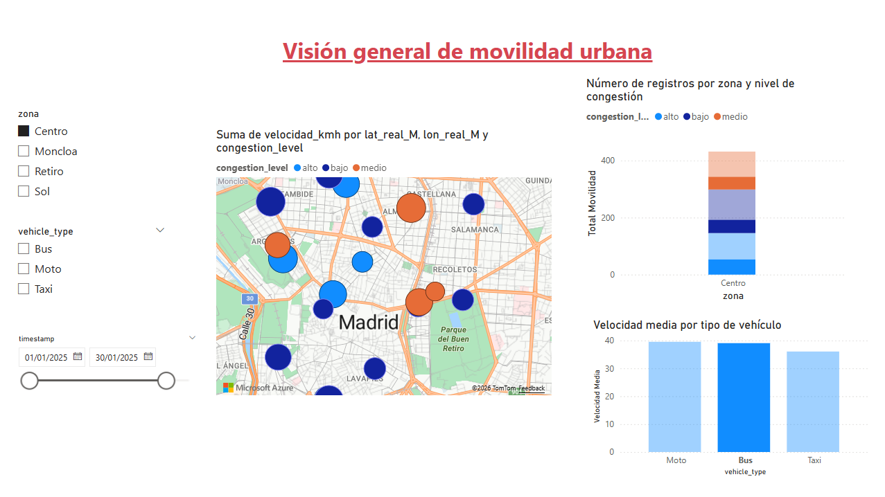

### 📡 Sensors Dashboard

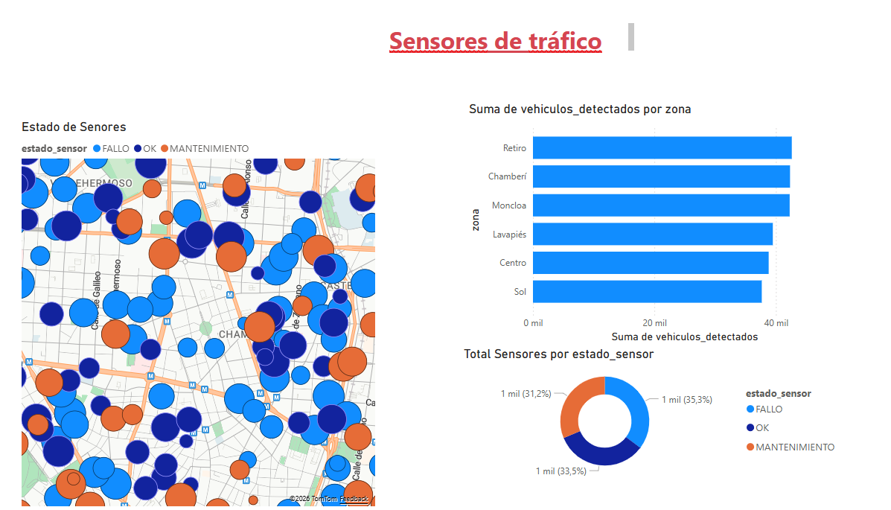

### 🚌 Transport Analysis and Combined Analysis

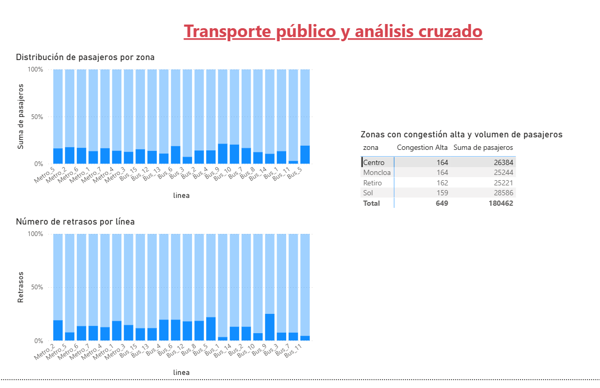

---

## ⚙️ How to Run the Project

1. Upload datasets from `/data/` into HDFS
2. Create Hive tables using scripts from `/sql/`
3. Load data into Hive tables
4. Execute analytical queries
5. Export results for visualization in Power BI

---

## 💼 Business Impact

* Identifies high congestion areas across the city
* Detects peak traffic hours and movement patterns
* Evaluates sensor reliability and data quality
* Analyzes public transport demand by zone and line
* Supports decision-making for urban mobility optimization

---
## ⚠️ Limitations
- Data is simulated and not real-time
- Batch processing only (no streaming pipeline)
- No automated orchestration (e.g., Airflow)

This project focuses on demonstrating core Big Data architecture concepts rather than production deployment.
---

## 🚀 Future Improvements

* Integrate real-time data streaming with Kafka
* Add Apache Spark for large-scale processing
* Orchestrate pipelines using Apache Airflow
* Deploy as a scalable cloud-based solution (AWS / Azure)

---

## 📁 Project Structure

```
├── architecture/
├── dashboards/
├── hive_results/
├── sql/
├── data/
├── README.md
```

---

## 🧩 Key Learnings

* Designed and implemented a distributed data architecture
* Worked with Hive for large-scale data processing
* Integrated multiple datasets for advanced analytics
* Translated technical results into business insights

---

## 👨‍💻 Author

**Ernest Oppong**
